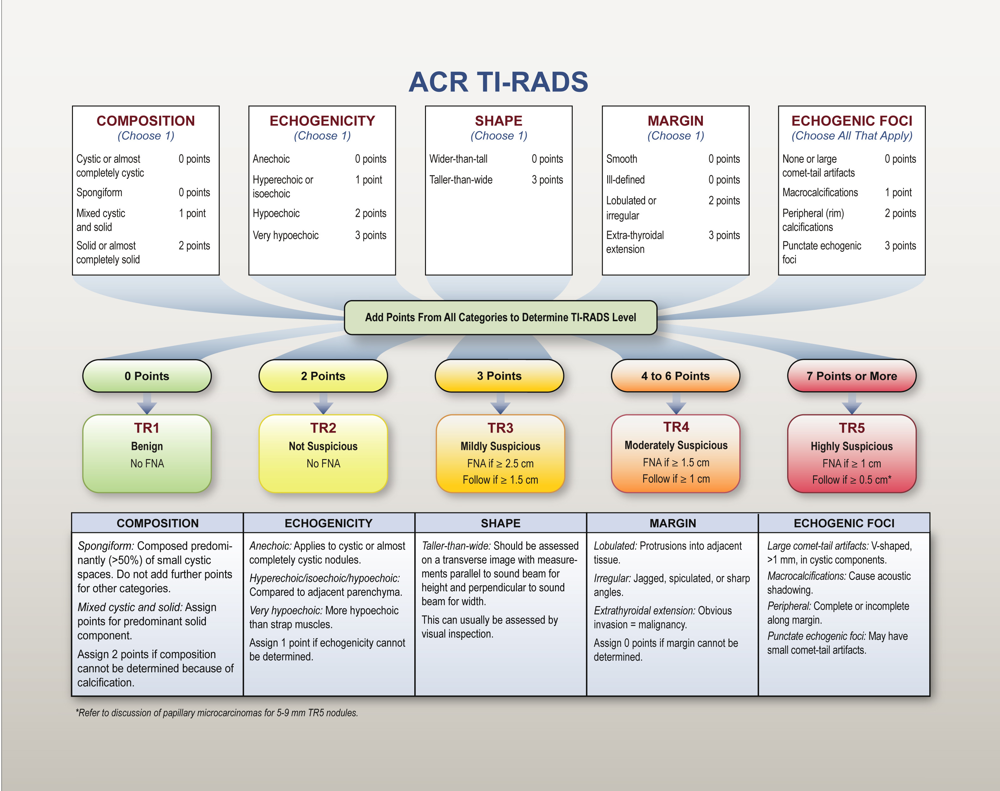
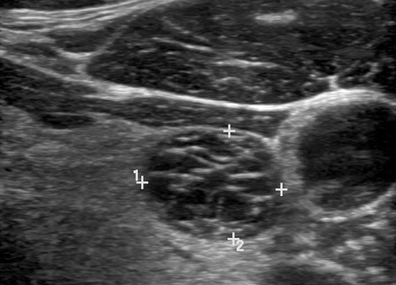
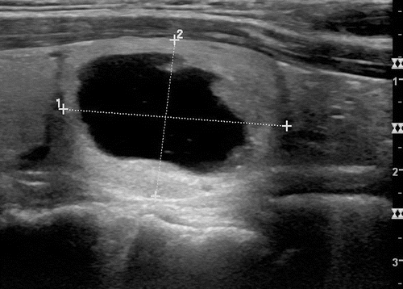
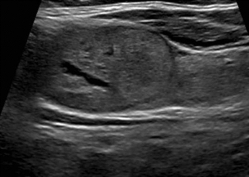
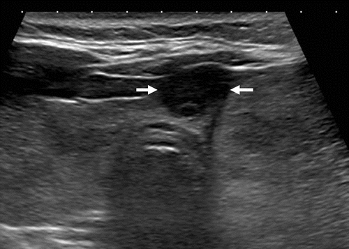
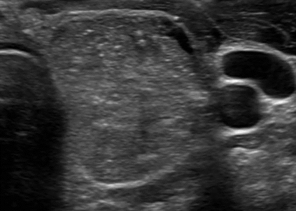

# Machine learning with ultrasound to automate risk stratification and reduce fine needle aspiration in thyroid cancer

#### Background:
Thyroid nodules are prevalent among adults, though only a small portion of these nodules are malignant. Ultrasounds are commonly used to risk stratify nodules and definitive diagnosis is made through invasive procedures, such as fine needle aspiration (FNA). This study aims to automatically risk stratify thyroid nodules to determine which nodules need FNA and ultimately reduce the number of unnecessary FNAs. While machine learning has been applied to improve Thyroid Imaging, Reporting, and Data System (TI-RADS) using manually extracted features, to date there has been few applications of machine-learning to automatically classify ultrasound images. 

#### Methods:
This retrospective study analyzed shear-wave elastography (SWE) and B-mode ultrasound images of thyroid nodules. Convolutional neural networks were utilized in this automated system to classify a nodule as malignant or benign. Pairs of 964 SWE and B-mode images were split into training (n=636), validation (n=159), and test (n=169) . Of these nodules, 22% were malignant and 78% were benign. The training images were used to fine tune the ResNet-50 classification architecture and a variety of hyperparameter settings were explored. 

#### Results: 
The automated system could correctly predict malignancy in thyroid nodules within the test set with an accuracy of 88.7% and an area under the curve of 0.914. This classification system provided a test statistic for each lesion, effectively estimating the percent likelihood of malignancy. This statistic could be used to rank nodules in patients with multiple suspicious lesions, providing insight into which nodules to biopsy in multi-nodule disease. 

#### Conclusion:
This automated system demonstrated that classification of thyroid nodules as malignant or benign using machine learning is feasible. Future work will include the utilization of this prediction model to grade thyroid nodules using the full TIRADS scale. Automating TIRADS may be useful to guide practitioners using evidence-based recommendations, lead to rapid and reproducible structured reports, decrease invasive procedures to diagnose nodules, and provide a metric for quantifying the severity of thyroid nodules.

 

   

Examples of thyroid nodule ultrasound images from the Radiological Society of North America

###### TI-RADS 1: 

###### TI-RADS 2: 

###### TI-RADS 3: 

###### TI-RADS 4: 

###### TI-RADS 5: 

 

##### References:
###### Horvath, E., et al. (2009). An Ultrasonogram Reporting System for Thyroid Nodules Stratifying Cancer Risk for Clinical Management. The Journal of Clinical Endocrinology & Metabolism, 94(5), 1748–1751.
###### Park, J.-Y., et al. (2009). A Proposal for a Thyroid Imaging Reporting and Data System for Ultrasound Features of Thyroid Carcinoma. Thyroid, 19(11), 1257–1264.
###### Tessler, F. N., et al. (2017). ACR Thyroid Imaging, Reporting and Data System (TI-RADS): White Paper of the ACR TI-RADS Committee. Journal of the American College of Radiology, 14(5), 587–595.
